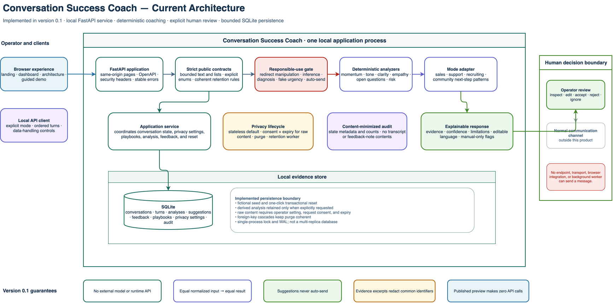
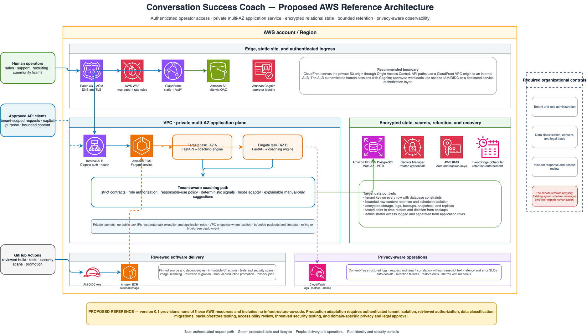

# Conversation Success Coach

[](https://github.com/hk-775/conversation-success-coach/actions/workflows/ci.yml)
[](https://hk-775.github.io/conversation-success-coach/)
[](LICENSE)
[](pyproject.toml)

Conversation Success Coach is an open-source, human-in-control coaching system
for consequential conversations. It analyzes observable language and turn
structure, explains what it found, and suggests editable next actions for:

- sales;
- customer support;
- recruiting; and
- community moderation.

It does not send messages, infer protected traits, diagnose people, or claim to
know hidden emotion or intent.

## Explore

- [Published product site](https://hk-775.github.io/conversation-success-coach/)
- [Published synthetic dashboard](https://hk-775.github.io/conversation-success-coach/dashboard.html)
- [Interactive architecture](https://hk-775.github.io/conversation-success-coach/architecture.html)
- [Evaluator startup guide](STARTUP.md)
- [Five-to-ten-minute demo guide](docs/DEMO.md)

The published dashboard uses fictional browser-local data and makes no API or
WebSocket calls. It supports navigation, scenario selection, guided review, and
synthetic analysis. State-changing controls are deliberately disabled. Run the
local service for the complete workflow.

## Current architecture



[Editable draw.io source](site/assets/system-architecture.drawio)

Version 0.1 is intentionally compact: a static browser experience, strict
FastAPI contracts, a responsible-use boundary, deterministic analyzers, four
mode adapters, human review, and optional bounded SQLite persistence.

## Start the fully seeded local demo

Requirements:

- Python 3.11 or newer;
- [`uv`](https://docs.astral.sh/uv/); and
- local port `8103`.

```bash
./scripts/demo.sh
```

Open:

- product home: `http://127.0.0.1:8103`
- dashboard: `http://127.0.0.1:8103/dashboard`
- architecture: `http://127.0.0.1:8103/architecture`
- OpenAPI: `http://127.0.0.1:8103/docs`

The first launch creates a local SQLite database and seeds four fictional
scenarios, their real deterministic analyses, playbooks, feedback, outcomes,
privacy settings, and content-minimized audit history.

Docker is also supported:

```bash
docker compose up --build
```

Compose binds the unauthenticated demo to `127.0.0.1:8103` by default. Do not
expose it to an untrusted network.

See [QUICKSTART.md](QUICKSTART.md) for the walkthrough and troubleshooting.

## What the coach returns

Each analysis includes:

- **momentum** — turn balance, forward-motion cues, stalling language, and open
  loops;
- **tone** — observable courtesy, friction, emphasis, and hostile-language
  cues;
- **clarity** — sentence structure, vague qualifiers, and concrete time or
  quantity cues;
- **empathy** — explicit acknowledgment of stated impact, without claiming
  hidden emotion;
- **unanswered questions** — topic-aware open-loop detection;
- **risk and escalation** — visible threat, harassment, trust-break, and
  sensitive-data cues; and
- **next-best actions** — mode-specific suggestions with rationale, evidence,
  confidence, limitations, and playbook references.

Equal normalized inputs produce equal fingerprints, scores, and suggestions.
The engine is deterministic Python code, not a remote model wrapper.

## Human agency and responsible use

Every suggestion is optional and marked:

```json
{
  "delivery": "manual_only",
  "requires_human_review": true,
  "can_auto_send": false
}
```

The implementation redirects explicit requests for:

- covert manipulation;
- protected-attribute inference or targeting;
- mental-health or personality diagnosis;
- fabricated urgency or scarcity;
- dependency optimization;
- impersonation; and
- automatic message delivery.

These controls are useful boundaries, not a complete legal, discrimination,
DLP, or safety assurance system. See [docs/ETHICS.md](docs/ETHICS.md).

## Data minimization

- Ad hoc analysis is stateless by default.
- Persisted analysis requires a 1–30 day retention period.
- Raw conversation storage additionally requires the operator setting,
  request-level consent, and an expiry.
- Audit records exclude transcript text and free-form feedback-note contents.
- Evidence excerpts redact several common direct-identifier shapes.
- Privacy APIs support conversation purge, all-non-demo purge, and retention
  enforcement.

Pattern redaction is not complete DLP. Use fictional data for evaluation.

## API example

```bash
curl -s http://127.0.0.1:8103/api/v1/analyze \
  -H 'Content-Type: application/json' \
  -d '{
    "mode": "support",
    "turns": [
      {
        "speaker": "Case participant",
        "role": "participant",
        "text": "This is blocking our deadline. When will it be fixed?"
      },
      {
        "speaker": "Case operator",
        "role": "operator",
        "text": "I am checking the worker now."
      }
    ]
  }'
```

See [docs/API.md](docs/API.md) for endpoints and schema behavior.

## Published artifact behavior

The canonical browser source is:

```text
src/conversation_success_coach/web/
```

`site/` is an exact byte-for-byte publication mirror. The package and Pages
workflows reject drift.

In published mode:

- the Pages subpath is tested in Chrome;
- landing, dashboard, architecture, diagrams, guided tour, and mobile layout
  remain functional;
- synthetic analysis stays in the browser;
- reset, transcript edits, feedback, playbook mutation, privacy mutation,
  purge, and retention controls are disabled; and
- no API, external HTTP request, or WebSocket is allowed.

## Proposed AWS reference



[Editable draw.io source](site/assets/aws-reference-architecture.drawio)

This is a proposed production direction, not a deployed environment. Version
0.1 provisions no AWS resources and ships no infrastructure-as-code.

The reference shows:

- Route 53 and ACM for DNS and TLS;
- AWS WAF and CloudFront;
- private S3 static hosting through Origin Access Control;
- a CloudFront VPC origin to an internal Application Load Balancer;
- Cognito authentication for human operators;
- ECS Fargate tasks across private subnets and Availability Zones;
- Amazon RDS for PostgreSQL Multi-AZ;
- Secrets Manager, KMS, and EventBridge Scheduler;
- privacy-aware CloudWatch telemetry; and
- GitHub Actions OIDC, ECR, and reviewed deployment promotion.

Production blockers and assumptions are documented in
[docs/PRODUCTION_READINESS.md](docs/PRODUCTION_READINESS.md),
[docs/THREAT_MODEL.md](docs/THREAT_MODEL.md), and
[docs/DEPLOYMENT.md](docs/DEPLOYMENT.md).

## Validate the package

```bash
uv sync --locked --extra dev
./scripts/test.sh
./scripts/validate.sh
./scripts/smoke.sh
node scripts/test_public_site.mjs
uv build
```

Validation covers:

- Python 3.11 and 3.12;
- branch coverage at or above 80%;
- Ruff and Bandit;
- locked dependency auditing;
- required open-source artifacts;
- exact static mirror equality;
- editable draw.io and PNG dimensions;
- immutable GitHub Action references;
- a real API smoke test on port `8103`;
- wheel installation outside the checkout; and
- Chrome behavior at the GitHub Pages repository subpath.

## Project structure

```text
src/conversation_success_coach/
  analysis.py       deterministic signal and suggestion engine
  safety.py         responsible-use policy and evidence redaction
  schemas.py        strict public contracts
  repository.py     SQLite state, metrics, audit, purge, retention
  seed.py           canonical fictional demo
  app.py            FastAPI application and pages
  web/              canonical landing, dashboard, architecture, assets
site/               exact publishable mirror
tests/              analysis, safety, state, feedback, privacy tests
docs/               API, architecture, demo, ethics, deployment, readiness
```

## Documentation

- [Quick start](QUICKSTART.md)
- [Evaluator startup](STARTUP.md)
- [Architecture](docs/ARCHITECTURE.md)
- [API reference](docs/API.md)
- [Demo guide](docs/DEMO.md)
- [Ethics and responsible use](docs/ETHICS.md)
- [Threat model](docs/THREAT_MODEL.md)
- [Production readiness](docs/PRODUCTION_READINESS.md)
- [Deployment](docs/DEPLOYMENT.md)
- [Publication inventory](docs/PUBLICATION_ARTIFACTS.md)
- [Security policy](SECURITY.md)
- [Contributing](CONTRIBUTING.md)
- [Governance](GOVERNANCE.md)
- [Support](SUPPORT.md)
- [Launch materials](launch-materials.md)

## Status and license

Version 0.1 is an alpha-quality local evaluation package. It is not a
production multi-user service.

Licensed under [MIT-0](LICENSE). See [NOTICE](NOTICE).
