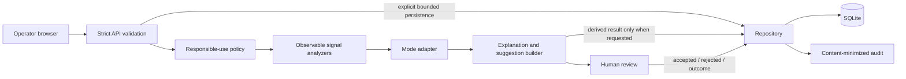
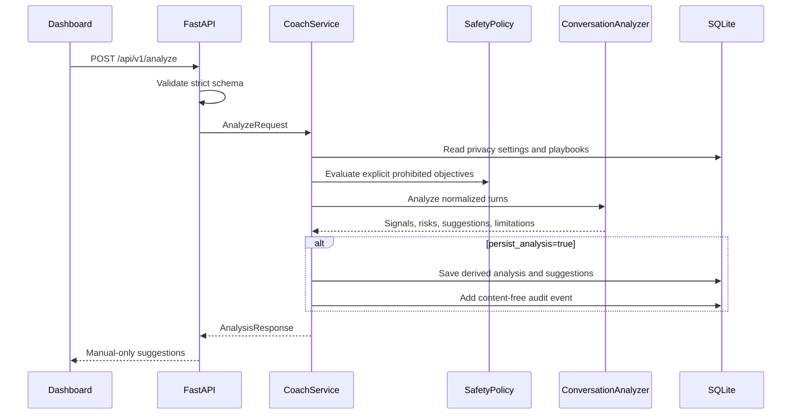
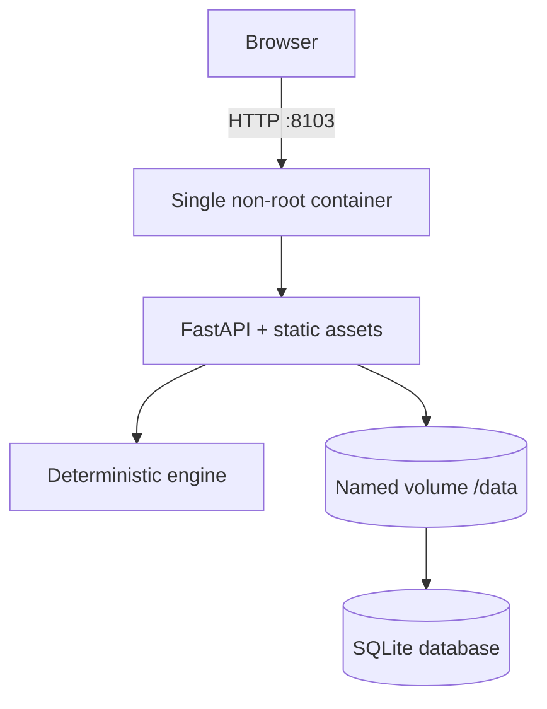

# Architecture

## Goals

Conversation Success Coach is intentionally a compact standalone product:

- one Python service;
- one deterministic analysis engine;
- one SQLite database;
- one no-build browser experience; and
- no external credentials, model APIs, or network dependencies.

The architecture favors explainability, meeting reliability, and easy code
inspection over distributed scale.

## Published diagrams

Current implementation:


- editable source: `site/assets/system-architecture.drawio`
- packaged source: `src/conversation_success_coach/web/assets/`

Proposed AWS production direction:


- editable source: `site/assets/aws-reference-architecture.drawio`
- status: reference only; not deployed
- version 0.1 provisions no AWS resources and includes no infrastructure-as-code

## Logical view



## Components

### Static product experience

Location: `src/conversation_success_coach/web/`

The landing page, dashboard, and architecture explorer use plain HTML, CSS, and
JavaScript. They require no Node package, CDN, external font, generated bundle,
or build cache.

The FastAPI service serves the same files that are mirrored under `site/`.
`./scripts/sync-site.sh` performs the mirror, and `./scripts/validate.sh`
requires it to be exact.

When `site/dashboard.html` is published on GitHub Pages or opened with
`?public-site=true`, it switches before any API probe to a clearly labeled
read-only synthetic preview. Navigation, scenarios, guided review, and
browser-local analysis remain functional. All state-changing controls are
disabled. The Chrome publication test rejects API, external HTTP, and WebSocket
traffic.

### FastAPI application

Location: `src/conversation_success_coach/app.py`

Responsibilities:

- application lifecycle;
- strict request and response routing;
- structured validation errors;
- same-origin static pages;
- security headers;
- content-type and cache behavior;
- endpoint-level not-found and privacy-policy errors; and
- local demo reset.

The application has no CORS middleware because the served dashboard is
same-origin. The static preview does not call an external API.

### Schemas

Location: `src/conversation_success_coach/schemas.py`

Public schemas:

- reject unknown fields;
- bound text and list lengths;
- use explicit mode, role, feedback, and outcome enums;
- require internally consistent data-handling controls; and
- make manual delivery and human review literal response values.

For example, `store_raw_content=true` is invalid unless analysis persistence,
consent confirmation, and a 1–30 day retention period are also present.

### Responsible-use policy

Location: `src/conversation_success_coach/safety.py`

The policy inspects explicit request and transcript text for:

- covert manipulation;
- protected-attribute inference or targeting;
- mental-health diagnosis;
- deceptive urgency;
- dependency optimization;
- impersonation or automatic sending;
- threats;
- harassment;
- escalation or trust breaks; and
- common direct-identifier shapes.

It does not infer hidden intent or personal traits. Prohibited objectives yield
a `redirected` responsible-use response and transparent alternative.

Evidence excerpts redact email, phone, payment-number, government-id, and long
number shapes. This is a limited heuristic, not a general DLP system.

### Deterministic coaching engine

Location: `src/conversation_success_coach/analysis.py`

The engine:

1. normalizes explicit input text;
2. creates a canonical SHA-256 fingerprint;
3. identifies unanswered participant questions;
4. scores momentum, tone, clarity, and empathy;
5. detects risk and escalation signals;
6. calculates an overall directional score;
7. applies a mode-specific next-step adapter; and
8. returns explanations, evidence, confidence, limitations, and suggestions.

Equal normalized inputs produce equal fingerprints, scores, and suggestions.
`created_at` and persistence expiry are the only time-dependent response
fields.

### Mode adapters

The four explicit modes share the same signal and safety core:

| Mode | Next-step emphasis | Prohibited shortcut |
|---|---|---|
| Sales | answer buying questions, summarize stated need, ask permission for a concrete next step | pressure, fake scarcity, hidden persuasion |
| Support | acknowledge impact, name action/owner/checkpoint, provide escalation path | overpromising, dismissing impact |
| Recruiting | consistent process facts, estimates, job-relevant questions and accommodations | protected-trait inference or diagnosis |
| Community | behavior-specific norm, concrete change, pause/review/appeal | identity or motive speculation |

### Service layer

Location: `src/conversation_success_coach/service.py`

The service coordinates:

- conversation existence;
- operator privacy settings;
- enabled mode playbooks;
- deterministic analysis;
- optional raw-turn replacement for consented retained workspaces;
- persisted derived analysis; and
- feedback reference validation.

It raises explicit not-found or privacy-policy conflicts for the API layer.

### Repository and SQLite

Locations:

- `src/conversation_success_coach/database.py`
- `src/conversation_success_coach/repository.py`

Tables:

- `metadata`
- `privacy_settings`
- `conversations`
- `turns`
- `analyses`
- `suggestions`
- `feedback`
- `playbooks`
- `audit`

SQLite foreign keys and cascades keep a conversation purge coherent. WAL mode
is enabled for a file-backed database. One connection is protected by a
reentrant lock for the standalone server and test client.

This design is not intended for high-write, multi-replica deployment.

## Proposed AWS reference

The reference diagram separates the public static site from the private
application plane:

- Route 53 and ACM provide DNS and TLS.
- AWS WAF protects CloudFront.
- CloudFront serves an S3 origin through Origin Access Control.
- `/api/*` uses a CloudFront VPC origin to an internal Application Load
  Balancer.
- The ALB authenticates human sessions with Cognito.
- ECS Fargate runs the FastAPI and deterministic coaching service in private
  subnets across Availability Zones.
- Amazon RDS for PostgreSQL Multi-AZ replaces SQLite.
- Secrets Manager and KMS protect runtime credentials and stored data.
- EventBridge Scheduler invokes bounded retention enforcement.
- CloudWatch receives content-minimized logs, metrics, and alarms.
- GitHub Actions assumes an OIDC role, publishes a scanned image to ECR, and
  promotes through a reviewed deployment.

This topology is not a production-readiness claim. Tenant isolation,
authorization, data classification, migrations, backup/restore, observability,
incident response, accessibility, security testing, and domain review remain
blocking work.

### Audit model

Audit records contain:

- event type;
- actor label;
- resource type and id;
- short summary;
- bounded metadata; and
- timestamp.

They deliberately exclude:

- transcript text;
- suggestion draft text;
- free-form feedback note contents; and
- deleted content.

A purge receipt records scope and counts while preserving that exclusion.

### Seed

Location: `src/conversation_success_coach/seed.py`

The canonical seed creates:

- four fictional conversations;
- four mode playbooks;
- deterministic analyses from the real engine;
- accepted/rejected suggestion feedback;
- neutral outcomes; and
- an audit baseline.

`POST /api/v1/demo/reset` deletes mutable state in a foreign-key-safe
transaction and reconstructs that seed.

## Analyze request flow



## Privacy lifecycle

### Default path

`DataHandling()` defaults to:

```json
{
  "persist_analysis": false,
  "store_raw_content": false,
  "retention_days": 0,
  "consent_confirmed": false
}
```

The analysis response is returned and not written to SQLite.

### Persisted derived result

`persist_analysis=true` requires `retention_days` from 1 through 30. The
derived analysis and suggestion payloads are stored until expiry. Raw turns are
not copied by that request.

### Retained raw conversation

New non-demo conversations require:

- `allow_raw_content_storage=true` in privacy settings;
- `consent_confirmed=true`; and
- a 1–30 day conversation expiry.

An analysis request that stores raw content repeats those requirements and must
reference an existing conversation.

### Deletion

- per-conversation purge cascades through turns, analyses, suggestions, and
  associated feedback;
- `all_non_demo` removes user-created conversations, standalone analyses, and
  playbooks;
- retention removes expired non-demo conversations and analyses; and
- audit retention deletes old audit metadata according to the configured
  window.

## Deployment view



The Compose profile is suitable for local evaluation. A production deployment
must add authentication, authorization, TLS, request limits, durable backup and
recovery, and an appropriate database or single-writer topology.

## Architectural limitations

- English-oriented lexical rules;
- no transcription, embeddings, or semantic model;
- no real-time stream or websocket;
- no platform connectors;
- no authentication or tenant isolation;
- one-process SQLite state; and
- no causal inference from outcome feedback.
